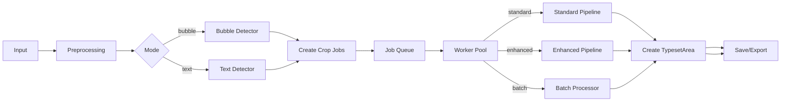
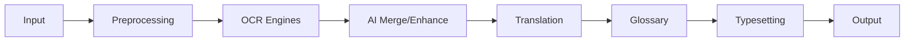
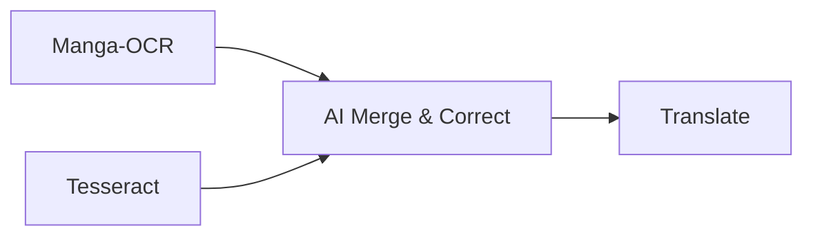

# Manga OCR & Typeset Tool v14.5.11

[]() []()

## v14.5.11 (Current)

- **[MAJOR] Unified multi-engine OCR + AI-enhanced pipeline**

  - Both Standard and Enhanced pipelines are implemented in the worker layer:
    - Standard: preprocessing → OCR → cleanup → translation (DeepL or AI) → post-process/naturalize
    - Enhanced: Manga-OCR (raw crop) + Tesseract (preprocessed) combined, then AI merge/correction via a selected model
  - AI translation is exposed via `translate_with_ai(...)` with provider/model, is_enhanced flag and `ocr_results` for improved context.

- **[MAJOR] Batch & Queue improvements**

  - Dynamic worker queue (`QueueProcessorWorker`) processes jobs in parallel and emits thread-safe signals for UI updates.
  - `BatchProcessorWorker` supports OpenAI batch endpoints and Gemini-style batched prompts with numbered-snippet parsing.
  - Rate-limit awareness: workers call `wait_for_api_slot()` which polls `check_and_increment_usage()` and backoffs automatically before retrying.

- **[MAJOR] Robust API management & fallback**

  - Centralized API settings (`APIManagerPanel` / `SettingsCenterDialog`) and `refresh_api_clients()` to hot-reload keys.
  - Automatic fallback behavior: AI translate failures fall back to non-AI translation (DeepL / configured fallback).
  - OpenAI batch submission integration (`client.batches.create`) for large-page translation throughput.

- **[IMPROVEMENT] Safety & content hygiene**

  - Safe Mode filtering applied post-translation (configurable) to redact explicit words.
  - Translation sanitizer strips fences and wrappers, ensuring raw text output for typesetting.

- **[IMPROVEMENT] UX & typesetting features**

  - `AdvancedTextEditDialog` with per-segment rich styling, Bezier curve controls, and bubble rendering options.
  - `SelectableImageLabel` supports transform (rotate/scale/move), pen/manual polygon selection, pending detection confirmation, and interactive handles.
  - `BatchSaveWorker` for threaded export of typeset images (draws areas onto `QImage` and saves PNGs without blocking UI).

- **[IMPROVEMENT] Robust engine & dependency handling**

  - Autodetect Tesseract on first-run; centralized `check_dependency()` and `ensure_dependencies()` helpers manage optional engines (Manga-OCR, PaddleOCR, RapidOCR, lama-cleaner, etc.).
  - `FontManager` handles importing, registering, and listing custom fonts used by the typesetter.

---

## Updated Pipeline (v14.5.11)

Below is a simplified flow that avoids mermaid parser quirks by keeping node labels short and avoiding special characters inside nodes.



Key notes:

- Detection: `AutoDetectorWorker` performs either bubble detection (DL model → mask → contours) or text detection (OCR boxes). Detected polygons are queued and may be confirmed by the user before creating jobs.

- Job execution (`QueueProcessorWorker`):

  - Pulls crop jobs from `main_app.get_job_from_queue()`.
  - Chooses pipeline per job based on `settings['enhanced_pipeline']`.
  - Standard pipeline uses orientation-aware preprocessing for Latin scripts and preserves raw crops for Manga-OCR/AI OCR engines.
  - Enhanced pipeline runs Manga-OCR on the raw crop and Tesseract on a preprocessed crop, then passes both results to AI (via `translate_with_ai`) for context-aware merge and correction.

- Translation & rate limits:

  - AI translation uses `translate_with_ai(...)` and respects provider/model rate limits with `wait_for_api_slot()`.
  - `BatchProcessorWorker` groups page snippets and will use OpenAI batch endpoints when available or send a single batched prompt for Gemini-style providers.

- Persistence & exports:
  - `ProjectSaveWorker` serializes the project atomically.
  - `BatchSaveWorker` draws typeset areas onto images in a background thread and emits `file_saved` signals.

This pipeline reflects the behavior implemented in `main.py` (workers, enhanced pipeline, batch handling, rate-limit wait/backoff, and typesetter integration).

---

## Detailed Pipeline

### 1) High-level pipeline



### 2) Components

#### A. Input & Project Management

- Purpose: Load images/PDFs and manage project state.
- Components: File dialog, PyMuPDF extraction for PDF, setup project folder, glossary load.

#### B. Smart Preprocessing

- Purpose: Optimize images for OCR; includes orientation detection and corrective rotation, adaptive thresholding and denoising.

#### C. Multi-engine OCR with fallback

- Purpose: Extract text using best engine for the language.
- Strategy: Manga-OCR prioritized for Japanese, PaddleOCR for Chinese/Korean, Tesseract/EasyOCR for general cases. Enhanced pipeline merges multiple OCR outputs when enabled.

#### D. Enhanced AI pipeline

- Purpose: Increase accuracy by combining Manga-OCR + Tesseract + AI correction/merging.



## Example configuration snippets

Here are minimal examples that match the application's `default_settings()` structure. Place `settings.json` next to `main.py` or copy values into the GUI settings panel.

settings.json (minimal)

```json
{
  "apis": {
    "gemini": {
      "keys": [
        { "name": "gemini-1", "value": "YOUR_GEMINI_KEY", "active": true }
      ]
    },
    "openai": { "keys": [] },
    "deepl": { "keys": [] },
    "google": { "keys": [] }
  },
  "tesseract": {
    "path": "C:/Program Files/Tesseract-OCR/tesseract.exe",
    "auto_detected": false
  },
  "cleanup": {
    "use_background_box": true,
    "use_inpaint": true,
    "apply_mode": "selected",
    "text_color_threshold": 128,
    "auto_text_color": true
  }
}
```

config.ini (optional)

```ini
[API]
DEEPL_KEY =
GEMINI_KEY = YOUR_GEMINI_KEY
OPENAI_KEY =

[PATHS]
TESSERACT_PATH = C:\Program Files\Tesseract-OCR\tesseract.exe

[MODELS]
BIG_LAMA_PATH = big-lama\models\best.ckpt
ANIME_INPAINT_PATH = models\lama_large_512px.ckpt
```

## Example batch prompt (used by BatchProcessorWorker)

This is an example of a safe, numbered batch prompt the application builds when sending multiple snippets in one call. The goal is to get a numbered output so parsing is deterministic.

```
You are an expert manga translator. Translate the following numbered snippets into natural, idiomatic Indonesian.

Rules:
- Keep numbering in your output. Each line must start with the original number (e.g., "1. ").
- Only return the raw translated snippets (no commentary, no extra text).
- If a snippet is untranslatable, return "[N/A]" after the number.

Snippets:
1. Hello, how are you?
2. This is an example.
3. Unreadable / malformed snippet

Expected output (example):
1. Hai, apa kabar?
2. Ini adalah contoh.
3. [N/A]
```

## Tests for batch parsing utility

I added a simple parser at `batch_utils.py` and unit tests at `tests/test_batch_parse.py`.

- Parser: `parse_numbered_translations(text)` — extracts numbered lines and returns a map {index: translation} and supports multiline entries.

Running tests (PowerShell)

1. Create and activate your virtual environment (Windows PowerShell):

```powershell
python -m venv venv
; .\venv\Scripts\Activate.ps1
pip install --upgrade pip
pip install pytest
```

2. Run pytest from the project root:

```powershell
pytest -q
```

If `pytest` is not installed globally, the above commands will set up and run tests inside the venv.

---

**Prasyarat**

- Python 3.8+
- Tesseract OCR (install terpisah)
- GPU recommended untuk EasyOCR/PaddleOCR

**Langkah Instalasi**

```bash
# Buat virtual environment
python -m venv venv
source venv/bin/activate   # macOS/Linux
venv\Scripts\activate    # Windows

# Install dependencies
pip install --upgrade pip
pip install -r requirements.txt

# Install engines OCR opsional
pip install manga-ocr    # Untuk Manga-OCR
pip install paddleocr    # Untuk PaddleOCR
```

**File requirements.txt:**

```
PyQt5>=5.15
numpy>=1.21
opencv-python>=4.5
requests>=2.28
Pillow>=9.0
google-generativeai>=0.3.0
pytesseract>=0.3.10
easyocr>=1.6
PyMuPDF>=1.22
openai>=1.0.0
lama-cleaner>=1.0.0
```

---

## Konfigurasi (config.ini)

File konfigurasi dibuat otomatis saat pertama kali menjalankan aplikasi:

```ini
[API]
DEEPL_KEY = API-KEY
GEMINI_KEY = API-KEY
OPENAI_KEY = API-KEY

[PATHS]
TESSERACT_PATH = C:\Program Files\Tesseract-OCR\tesseract.exe

[MODELS]
BIG_LAMA_PATH = big-lama\models\best.ckpt
ANIME_INPAINT_PATH = models\lama_large_512px.ckpt
```

**Catatan**: Ganti placeholder dengan API key sebenarnya untuk menggunakan fitur AI.

---

## Cara Penggunaan

### 1. Setup Awal

- Jalankan aplikasi: `python main.py`
- Konfigurasi API keys di `config.ini`
- Muat folder project dengan gambar/PDF

### 2. Proses Translasi

1. Pilih engine OCR berdasarkan bahasa sumber
2. Tentukan style terjemahan yang diinginkan
3. Seleksi area teks dengan rectangle/pen tool
4. Review hasil OCR jika perlu
5. Terjemahkan dengan Gemini/DeepL

### 3. Kelola Glosarium

- Buat entri manual di tab Glossary
- Review saran otomatis dari AI
- Terapkan glosarium untuk konsistensi

### 4. Batch Processing

- Gunakan "Detect All Files" untuk proses otomatis
- Review dan konfirmasi detected bubbles
- Proses seluruh bubble sekaligus

### 5. Export Results

- Simpan individual image dengan "Save Image"
- Export batch dengan "Batch Save"
- Export ke PDF untuk kumpulan halaman

---

## Troubleshooting

**Masalah Umum dan Solusi:**

1. **Engine OCR tidak berjalan**:

   - Pastikan Tesseract terinstall dan path benar di config.ini
   - Untuk Manga-OCR/PaddleOCR: `pip install manga-ocr paddleocr`

2. **Error API Limit**:

   - Monitor usage di status bar bawah
   - Tunggu hingga limit reset atau upgrade plan API

3. **Performance lambat**:

   - Kurangi jumlah worker di pengaturan
   - Gunakan GPU untuk engine OCR yang mendukung

4. **Glossary tidak tersimpan**:
   - Pastikan folder project mempunyai permission write
   - Cek file `glossary.json` di folder project

---

## API Usage & Cost Management

Aplikasi mendukung berbagai model Gemini dengan karakteristik berbeda:

| Model                 | Kecepatan  | Biaya        | Recommended Use                  |
| --------------------- | ---------- | ------------ | -------------------------------- |
| Gemini 2.5 Flash Lite | ⚡⚡⚡⚡⚡ | $0.0001/1K   | Default, pemrosesan tinggi       |
| Gemini 2.5 Flash      | ⚡⚡⚡⚡   | $0.000125/1K | Fallback 1, akurasi lebih tinggi |
| Gemini 2.5 Pro        | ⚡⚡⚡     | $0.0025/1K   | Teks kompleks dan penting        |
| Gemini 2.0 Flash Lite | ⚡⚡⚡⚡⚡ | $0.0001/1K   | Darurat saat limit 2.5           |

---

## License

MIT License - lihat file LICENSE untuk detail lengkap.

---

## Contributing

Kontribusi dipersilakan! Untuk fitur besar, silakan buka issue terlebih dahulu untuk didiskusikan.

**Panduan kontribusi:**

1. Fork repository
2. Buat feature branch
3. Commit changes
4. Push ke branch
5. Buat Pull Request

---

# Changelog

## v14.0.1 (Current)

- **[MAJOR]** Added an “Add bubble” toggle in the manual selection toolkit to optionally auto-render a white bubble with a black outline on confirmation
- **[MAJOR]** Replaced inline editor with **AdvancedTextEditDialog**, supporting font/size/color controls, bold/italic/underline, alignment, line spacing, character spacing, margins, Bezier curve editing, manga-style effects (curved/wavy/jagged), orientation switching, and emoji insertion with partial text styling
- **[IMPROVEMENT]** Expanded `TypesetArea` to persist rich formatting metadata including bubble options, alignment, spacing, margins, effects, and per-segment styling with safe default fallbacks
- **[IMPROVEMENT]** Reworked the rendering pipeline to honor bubbles, inner margins, alignment, vertical/path-based text effects, and rich-text segments
- **[IMPROVEMENT]** Updated OCR worker flows to seed new `TypesetArea` instances with default advanced-layout options across batch and single-processing
- **[FIX]** Hooked edit actions into the new modal, applying user selections back into stored segments and resetting undo/redo cleanly

## vv14.0.0

- **[IMPROVEMENT]** Modernized UI/UX to be responsive and adaptive across all screen sizes (desktop, tablet, mobile), ensuring smooth navigation and consistent layout
- **[MAJOR]** Added a simple text editing modal: when users select an existing text, a modal window opens to edit text content directly, and after confirmation updates are applied back to the canvas
- **[MAJOR]** Added a new **AI Hardware** tab to organize and display hardware-related settings separately from the OCR and editing functions

## v13.0.1

- **[FIX]** Runtime crash dalam worker glossary (`RuntimeError: wrapped C/C++ object of type QThread has been deleted`)
- **[IMPROVEMENT]** Worker pool scaling yang lebih agresif (threshold diturunkan dari 5 ke 3)

## v13.0.0

- **[MAJOR]** Intelligent worker pooling dengan hingga 15 thread paralel
- **[MAJOR]** AI-powered glossary system dengan saran otomatis
- **[MAJOR]** Glossary manager UI dengan file-based persistence
- **[ENHANCEMENT]** Enhanced pipeline dengan kombinasi Manga-OCR + Tesseract + Gemini

## v12.0.3

- **[FIX]** Crash `cv2.mean` dengan validasi dimensi gambar
- **[IMPROVEMENT]** Auto-add glossary suggestions dengan pencegahan duplikat
- **[IMPROVEMENT]** Expanded translation styles dengan prompt yang lebih deskriptif

## v12.0.2

- **[FIX]** `AttributeError` pada Gemini API calls
- **[IMPROVEMENT]** Kembalikan opsi orientasi teks (Horizontal/Vertical)
- **[IMPROVEMENT]** Logika penguncian bahasa OCR yang disempurnakan

## v8.0-v12.0

- Integrasi Manga-OCR dan PaddleOCR
- Deteksi bubble otomatis dengan model DL
- Batch processing dan PDF export
- Manajemen proyek dan autosave
- Inpainting dan advanced typesetting tools

---

Untuk informasi lebih lanjut, issue, atau kontribusi, silakan kunjungi repository GitHub project ini.
