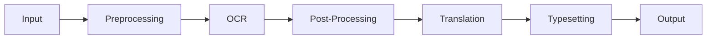
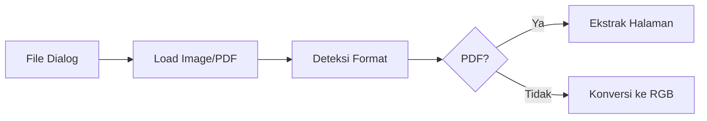
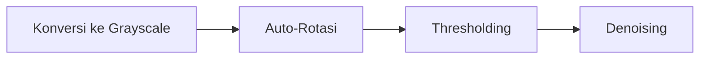
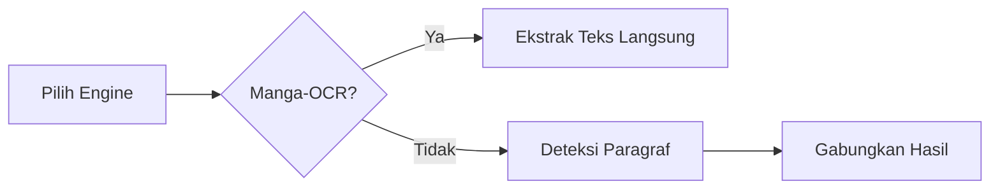
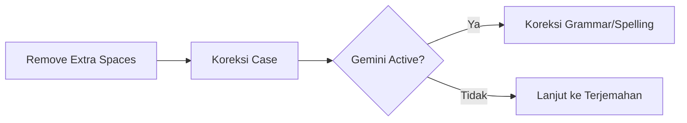
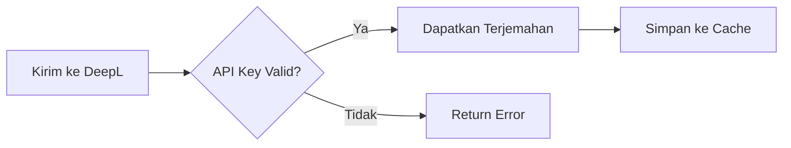
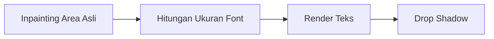
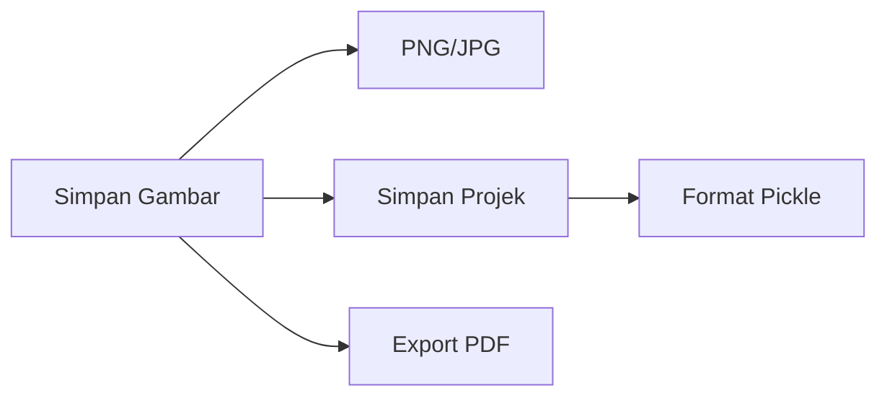
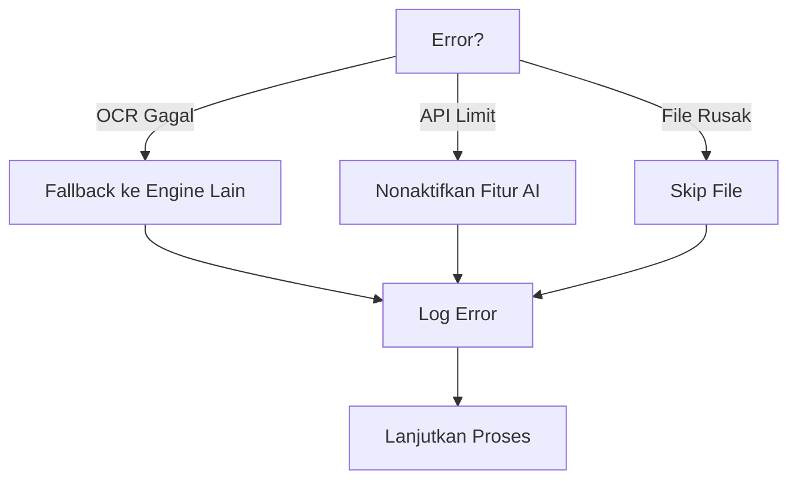
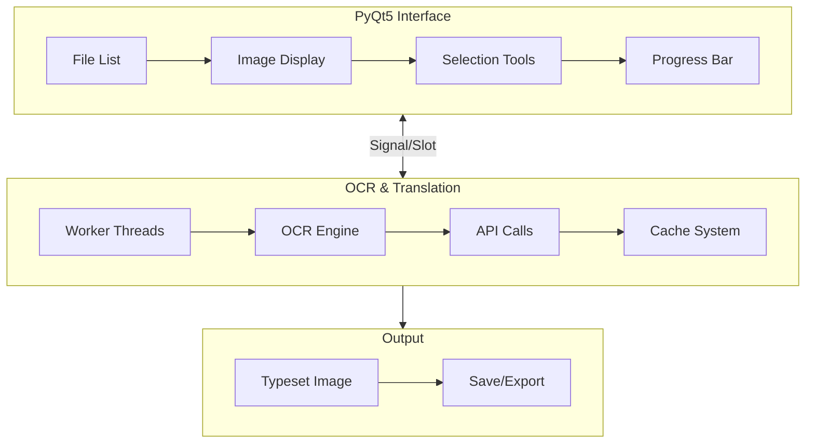

# Manga OCR & Typeset Tool v7.8

[]() []()

---

## Ringkasan

Aplikasi desktop untuk OCR, terjemahan, dan typesetting teks pada manga/komik. Mendukung multi-engine OCR (Manga-OCR, EasyOCR, Tesseract), koreksi AI (Gemini), terjemahan (DeepL), serta alat typeset lengkap (rectangle, pen/polygon, inline editor, inpainting).

Versi **7.8** menambahkan konfigurasi eksternal (`config.ini`) dengan pembuatan otomatis saat pertama kali dijalankan.

---

# Pipeline Detail: Manga OCR & Typeset Tool v7.8

Berikut adalah **pipeline detail** untuk alur sistem Manga OCR & Typeset Tool v7.8, yang menjelaskan setiap tahap secara berurutan dengan komponen terkait.

---

## **1. Pipeline Utama Sistem**



## **2. Pipeline Detail per Komponen**

### **A. Input**

- **Tujuan**: Memuat sumber gambar/PDF.
- **Komponen**:



- **Teknik**: `PIL.Image` untuk gambar, `PyMuPDF` untuk PDF, cache daftar file.

### **B. Preprocessing**

- **Tujuan**: Optimalkan gambar untuk OCR.
- **Komponen**:



- **Parameter**: Rotasi otomatis, adaptive thresholding `cv2.ADAPTIVE_THRESH_GAUSSIAN_C`.

### **C. OCR**

- **Tujuan**: Ekstraksi teks dari gambar.
- **Komponen**:



- **Engine**: Manga-OCR, EasyOCR, Tesseract (PSM).

### **D. Post-Processing**

- **Tujuan**: Bersihkan teks hasil OCR.
- **Alur**:



- **Fitur**: Gemini API dengan rate limit, cache hasil.

### **E. Translation**

- **Tujuan**: Terjemahkan teks ke bahasa target.
- **Alur**:



- **Optimasi**: Hash teks sebagai key, batch translation.

### **F. Typesetting**

- **Tujuan**: Render teks terjemahan ke gambar.
- **Alur**:



- **Teknik**: Inpainting `cv2.INPAINT_TELEA`, auto font scaling, dukungan teks vertikal.

### **G. Output**

- **Tujuan**: Simpan/ekspor hasil.
- **Pilihan**:



- **Fitur Khusus**: Auto-save tiap 5 menit, batch PDF.

---

## **3. Pipeline Error Handling**



---

## **4. Diagram Alir Integrasi**



---

### **Penjelasan Kunci Pipeline**

1. **Threading**: OCR dan terjemahan di `QThread` untuk hindari freeze GUI.
2. **Cache Multi-level**: Cache per gambar & projek.
3. **Fallback System**: Ganti engine otomatis jika gagal.
4. **PDF Support**: Ekstrak halaman dan navigasi PDF dengan OCR penuh.

---

## Fitur Utama

### 1. OCR (Optical Character Recognition)

- **Multi‑Engine Support**

  - _Manga-OCR_ — optimasi untuk teks manga Jepang (opsional jika library terinstal).
  - _EasyOCR_ — deteksi multi‑bahasa, dukungan GPU (jika tersedia).
  - _Tesseract_ — engine tradisional dengan dukungan bahasa (JPN/ENG/CHN/KOR).

- **Deteksi Orientasi Teks** (horizontal / vertikal) dan **rotasi otomatis**.
- **Preprocessing**: adaptive thresholding, denoise, deskew.

### 2. Penerjemahan

- Integrasi **DeepL API** untuk hasil terjemahan berkualitas.
- **Koreksi AI** menggunakan **Gemini API** untuk memperbaiki hasil OCR (typo, spacing, punctuation).
- Batasan (default): **15 RPM** dan **1000 RPD** (configurable).

### 3. Typesetting

- **Tools**: Rectangle tool, Pen tool (polygon), Inline editor.
- **Kustomisasi teks**: font, ukuran, warna, orientasi (H/V), outline effect.
- **Inpainting**: menghapus teks asli secara otomatis lalu mengganti dengan teks yang di‑typeset.

### 4. Manajemen Proyek

- Save/Load project (`.manga_proj`) yang menyimpan area typeset, teks, pengaturan.
- Autosave setiap 5 menit.

### 5. Dukungan Format

- Gambar: `PNG`, `JPG`, `JPEG`, `BMP`, `WebP`.
- PDF: buka & edit langsung (PyMuPDF/Fitz). Export folder gambar → PDF (filter: `.png`).
- Navigasi PDF dengan **scroll mouse**.

### 6. Batch Processing

- Deteksi bubble otomatis (EasyOCR) dan proses seluruh teks dalam satu gambar. (in-progress)
- Cache hasil OCR/terjemahan untuk menghindari proses berulang.(in-progress)

---

## Kelebihan & Kekurangan

**Kelebihan**

- Antarmuka ramah pengguna (dark/light mode).
- Modular: mudah ganti engine OCR / layanan terjemahan.

**Kekurangan**

- Banyak dependency (install awal berat).
- Pembatasan API (Gemini / DeepL) dapat membatasi throughput.
- Untuk performa optimal, disarankan GPU (EasyOCR).

---

## Instalasi

**Prasyarat**

- Python 3.8+
- Tesseract OCR (install terpisah). Default path Windows: `C:\Program Files\Tesseract-OCR\tesseract.exe`.

**Langkah**

```bash
# Buat virtualenv (opsional tapi direkomendasikan)
python -m venv venv
source venv/bin/activate   # macOS/Linux
venv\Scripts\activate    # Windows

# Install dependencies
pip install --upgrade pip
pip install PyQt5 numpy opencv-python requests Pillow torch torchvision torchaudio
pip install pytesseract easyocr google-generativeai manga-ocr
pip install PyMuPDF
```

> Catatan: `manga-ocr` bersifat opsional. Jika tidak terinstal, engine Manga-OCR akan otomatis dinonaktifkan.

---

## Konfigurasi (config.ini)

Pada pertama kali menjalankan aplikasi, file `config.ini` akan dibuat otomatis jika belum ada. Contoh isi `config.ini`:

```ini
[API]
DEEPL_KEY = YOUR_DEEPL_API_KEY_HERE
GEMINI_KEY = YOUR_GEMINI_API_KEY_HERE

[PATHS]
TESSERACT_PATH = C:\Program Files\Tesseract-OCR\tesseract.exe

```

**Langkah setting**: buka file `config.ini` dan ganti placeholder API key dengan key asli.

---

## Cara Pakai (Quick Start)

1. Jalankan aplikasi: `python main.py`
2. Pada run pertama, buka `config.ini` dan isi API key serta verifikasi `TESSERACT_PATH`.
3. Muat gambar atau PDF (`File → Open`).
4. Pilih engine OCR di panel kanan (EasyOCR / Tesseract / Manga-OCR).
5. Gunakan Rectangle/Pen tool untuk memilih area teks.
6. Klik `OCR Selected` → review hasil di panel OCR.
7. Klik `Translate` untuk menerjemahkan (opsional).
8. Pilih font & style lalu `Apply Typeset` untuk menimpa area.
9. Simpan project (`File → Save Project`) atau ekspor gambar/PDF (`Export`).

---

## Video Demo & Examples

> Ganti placeholder URL dengan link video dan gambar hasil yang sebenarnya.

| Tipe                |                                           Deskripsi | URL / Path                      |
| ------------------- | --------------------------------------------------: | ------------------------------- |
| Video Demo          | Demonstrasi fitur utama (OCR → Translate → Typeset) | `VIDEO_DEMO_URL`                |
| Example Image 1     |                         Halaman manga asli (Jepang) | `examples/original_page_01.png` |
| OCR Result 1        |                    Output hasil OCR sebelum koreksi | `examples/ocr_output_01.txt`    |
| Translated Result 1 |        Hasil terjemahan (DeepL + Gemini correction) | `examples/translated_01.txt`    |
| Typeset Result 1    |                        Gambar akhir setelah typeset | `examples/result_01.png`        |

> Catatan: Anda bisa menaruh contoh gambar di folder `examples/` di repo untuk kemudahan referensi.

---

## Developer Notes

- Pastikan untuk menambahkan rate limiter pada panggilan ke Gemini/DeepL agar tidak melebihi quota.
- Gunakan cache (file-based) untuk menyimpan hasil OCR/terjemahan per file_hash.
- Untuk performa: aktifkan CUDA jika tersedia dan EasyOCR mendukungnya.

---

## Troubleshooting

- **Tesseract not found**: Pastikan path di `config.ini` benar dan Tesseract terinstal.
- **manga-ocr missing**: `pip install manga-ocr` atau gunakan EasyOCR/Tesseract sebagai fallback.
- **API errors / rate limit**: turunkan frekuensi batch, atau aktifkan cache untuk mengurangi request.

---

## License

MIT

---

## Contributing

Silakan buka issue atau pull request. Ikuti kode gaya Python (PEP8) dan tambahkan unit tests untuk fitur baru.

---

# --- FITUR BARU DI v7.8 (Konfigurasi Eksternal) ---

1. File Konfigurasi (config.ini): API Key dan path Tesseract sekarang dikelola di luar skrip dalam file `config.ini`. Ini meningkatkan keamanan dan memudahkan pembaruan.
2. Pembuatan Config Otomatis: Jika `config.ini` tidak ditemukan saat aplikasi pertama kali dijalankan, file tersebut akan dibuat secara otomatis dengan nilai placeholder, memandu pengguna untuk melakukan setup.

# --- v7.7 (Peningkatan PDF & UX) ---

1. Navigasi Scroll PDF: Pengguna sekarang dapat menggunakan mouse wheel (scroll) untuk berpindah antar halaman saat melihat dokumen PDF, memberikan pengalaman navigasi yang lebih cepat dan intuitif.
2. Filter Ekspor PNG: Fitur "Export to PDF" sekarang secara spesifik hanya akan menyertakan file .png, memastikan output yang lebih bersih dan terprediksi.

# --- v7.6 (Integrasi PDF) ---

1. Ekspor ke PDF: Menambahkan opsi "File > Export Folder to PDF..." untuk mengonversi semua gambar di folder saat ini menjadi satu file PDF. File diurutkan secara numerik (natural sort) untuk memastikan urutan yang benar.
2. Penampil PDF Internal: Aplikasi sekarang dapat membuka dan menampilkan file .pdf langsung di jendela utama. Pengguna dapat menavigasi halaman PDF menggunakan tombol "Next" dan "Previous".
3. Fungsionalitas Penuh pada PDF: Semua alat OCR, seleksi, dan typesetting berfungsi pada halaman PDF yang sedang ditampilkan, sama seperti pada gambar biasa.

# --- v7.5 (Perbaikan Stabilitas Kritis) ---

1. Perbaikan Threading Limit API: Memperbaiki crash "QObject::startTimer: Timers cannot be started from another thread" yang terjadi saat limit API tercapai. Logika UI (memulai timer, menampilkan dialog) sekarang dipisahkan sepenuhnya dari logika pengecekan limit, memastikan semua operasi UI berjalan aman di main thread.
2. Alur Kerja Non-Review yang Lebih Mulus: Memperbaiki race condition yang menyebabkan error "A process is already running" saat checkbox "Review Before Translate" tidak dicentang. Transisi dari OCR ke Translate sekarang dijadwalkan dengan benar, memberikan waktu bagi thread sebelumnya untuk selesai.

# --- v7.4 (Perbaikan Stabilitas & Threading) ---

1. Perbaikan Alur Kerja Non-Review: Memperbaiki race condition yang menyebabkan error "A process is already running" saat checkbox "Review Before Translate" tidak dicentang. Transisi dari OCR ke Translate sekarang dijadwalkan dengan benar, memberikan waktu bagi thread sebelumnya untuk selesai.
2. Penanganan Limit API yang Aman untuk Thread: Memperbaiki crash dan freeze saat limit API tercapai. Peringatan dan timer sekarang dikelola sepenuhnya di main thread melalui sinyal, mencegah error threading.
3. Sinyal API Limit Baru: Menambahkan sinyal khusus `api_limit_reached` untuk berkomunikasi dari worker ke main thread, memastikan semua dialog dan update UI aman.

# --- v7.3 (Perbaikan Bug Kritis) ---

1. Perbaikan Konversi Gambar: Memperbaiki `TypeError` fatal yang terjadi saat menggambar ulang area yang sudah di-typeset. Logika konversi dari gambar PIL ke QImage telah diganti dengan metode yang benar dan stabil untuk mencegah crash.
2. Peningkatan Stabilitas Inisialisasi: Menambahkan pemeriksaan tambahan untuk memastikan instance Manga-OCR benar-benar dibuat sebelum digunakan, mencegah error "not initialized" jika terjadi kegagalan saat startup.

# --- v7.2 (Perbaikan Bug Kritis) ---

1. Perbaikan Tipe Argumen Rendering: Memperbaiki `TypeError` fatal yang terjadi saat menggambar ulang area yang sudah di-typeset. Masalah ini disebabkan oleh penggunaan objek `ImageQt` di mana `QImage` diharapkan. Konversi eksplisit ke `QImage` telah diterapkan untuk menyelesaikan crash.
2. Peningkatan Stabilitas Inisialisasi: Menambahkan pemeriksaan tambahan untuk memastikan instance Manga-OCR benar-benar dibuat sebelum digunakan, mencegah error "not initialized" jika terjadi kegagalan saat startup.

# --- v7.1 (Perbaikan Bug) ---

1. Inisialisasi OCR yang Tangguh: Inisialisasi setiap engine OCR (Manga-OCR, EasyOCR) ditangani secara terpisah. Kegagalan pada satu engine tidak akan menghentikan inisialisasi engine lainnya.
2. Perbaikan Rendering Gambar: Memperbaiki `TypeError` yang terjadi saat menggambar ulang area yang sudah di-typeset dengan menggunakan konversi gambar yang benar (PIL ke QImage).
3. Klarifikasi Teks Vertikal: Menambahkan dokumentasi untuk memperjelas bahwa teks vertikal dari hasil OCR secara otomatis diubah menjadi satu baris horizontal untuk proses terjemahan.
4. Logika Typesetting Vertikal yang Lebih Jelas: Mengganti nama fungsi dan menambahkan komentar untuk menjelaskan bahwa typesetting vertikal dicapai dengan merotasi blok teks, yang merupakan pendekatan umum.

# --- v7.0 ---

1. Integrasi Manga-OCR: Menambahkan 'manga-ocr' sebagai engine OCR baru, dioptimalkan untuk teks manga vertikal dan horizontal.
2. Kontrol Orientasi Teks: Dropdown baru untuk memilih orientasi teks (Auto, Horizontal, Vertikal) secara manual, meningkatkan akurasi Tesseract dan EasyOCR.
3. Perbaikan Alur "Review Before Translate": Proses dipecah menjadi dua tahap (OCR -> Review -> Translate) menggunakan sinyal antar-thread untuk memastikan dialog review muncul dengan benar di main thread tanpa membekukan GUI.
4. Perbaikan Mode Batch: Proses batch dibuat lebih tangguh dengan error handling per-gelembung teks. Kegagalan pada satu area tidak akan menghentikan seluruh proses.
5. Refactoring Worker Threads: Logika worker dipisahkan menjadi OCRWorker dan TranslateWorker untuk alur kerja yang lebih bersih dan modular.

---

Jika Anda ingin, saya dapat menambahkan contoh `config.ini` yang terisi lengkap, contoh video demo markdown embed, atau membuat file `examples/README` berisi gambar dan hasil yang bisa langsung ditunjukkan di repo.
