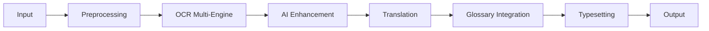
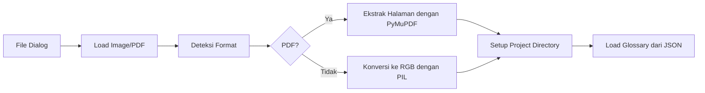
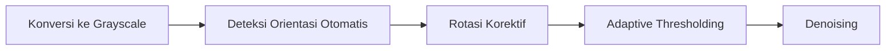
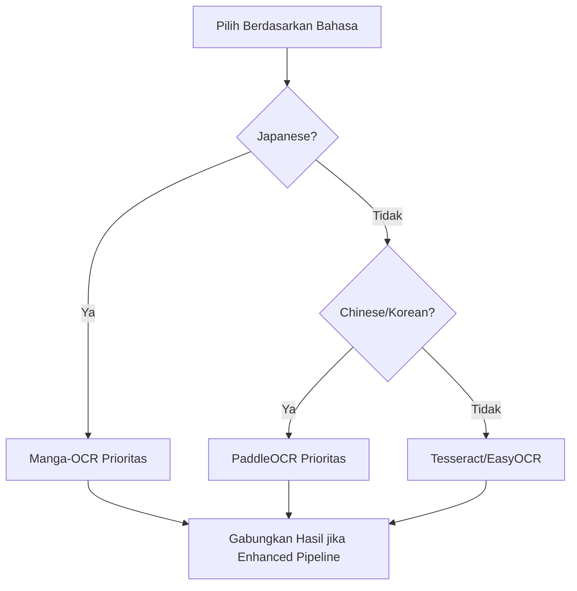
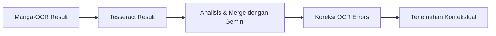
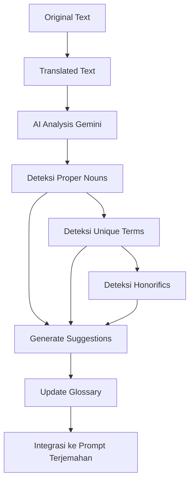
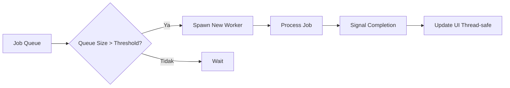
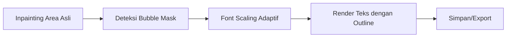

# Manga OCR & Typeset Tool v13.0.1

[]() []()

---

## Ringkasan

Aplikasi desktop canggih untuk OCR, terjemahan, dan typesetting teks pada manga/komik dengan dukungan AI. Mendukung multi-engine OCR (Manga-OCR, EasyOCR, Tesseract, PaddleOCR), koreksi dan terjemahan AI (Gemini), serta sistem glosarium pintar.

Versi **13.0.1** memperkenalkan sistem worker pool yang dinamis, sistem glosarium berbasis AI, dan perbaikan stabilitas.

---

## Pipeline Detail: Manga OCR & Typeset Tool v13.0.1

Berikut adalah **pipeline detail** untuk alur sistem yang telah ditingkatkan:

### **1. Pipeline Utama Sistem**



### **2. Pipeline Detail per Komponen**

#### **A. Input & Manajemen Proyek**

- **Tujuan**: Memuat sumber gambar/PDF dan mengelola proyek
- **Komponen**:



#### **B. Preprocessing Cerdas**

- **Tujuan**: Optimalkan gambar untuk OCR dengan deteksi orientasi otomatis
- **Komponen**:



#### **C. OCR Multi-Engine dengan Fallback**

- **Tujuan**: Ekstraksi teks dari gambar dengan engine terbaik untuk bahasa tertentu
- **Engine & Strategi**:



#### **D. Enhanced AI Pipeline**

- **Tujuan**: Tingkatkan akurasi dengan kombinasi Manga-OCR + Tesseract + Gemini
- **Alur**:



#### **E. Sistem Glosarium AI-Powered**

- **Tujuan**: Deteksi otomatis istilah penting dan pertahankan konsistensi terjemahan
- **Alur**:



#### **F. Dynamic Worker Pool**

- **Tujuan**: Pemrosesan paralel untuk throughput maksimal
- **Strategi**:



#### **G. Typesetting & Output**

- **Tujuan**: Render teks terjemahan ke gambar dengan preservasi konteks visual
- **Komponen**:



---

## Fitur Utama

### 1. OCR Multi-Engine Cerdas

- **Manga-OCR** - Dioptimalkan untuk teks manga Jepang
- **EasyOCR** - Deteksi multi-bahasa dengan dukungan GPU
- **Tesseract** - Engine tradisional dengan dukungan bahasa luas
- **PaddleOCR** - Khusus untuk bahasa China/Korea (opsional)
- **Deteksi Orientasi Otomatis** dengan rotasi korektif

### 2. AI-Powered Translation & Enhancement

- **Gemini Integration** untuk koreksi OCR dan terjemahan kontekstual
- **Enhanced Pipeline** kombinasi Manga-OCR + Tesseract + Gemini
- **Style Selection**: Santai, Formal, Akrab, Vulgar/Dewasa, Sesuai Konteks Manga
- **Auto-censorship** untuk konten eksplisit ("vagina" → "meong", "penis" → "burung")

### 3. Intelligent Glossary System

- **AI-Powered Suggestion** - Gemini menganalisis teks untuk menyarankan istilah penting
- **Glossary Manager** - UI khusus dengan tambah/edit/hapus entri
- **File-based Persistence** - Disimpan sebagai `glossary.json` dalam folder proyek
- **Real-time Integration** - Glosarium langsung terintegrasi dalam prompt terjemahan

### 4. Dynamic Worker Pool

- **Scalable Processing** - Hingga 15 worker thread paralel
- **Intelligent Scaling** - Worker baru dibuat berdasarkan ukuran antrian
- **Resource Management** - Worker otomatis dihentikan saat idle
- **Thread-safe UI Updates** - Pembaruan antarmuka yang aman dari thread

### 5. Advanced Typesetting Tools

- **Selection Tools**: Rectangle, Pen tool (polygon bebas)
- **Inline Editor** - Edit teks langsung pada gambar
- **Vertical Typesetting** - Dukungan untuk teks vertikal
- **Bubble Detection** - Deteksi otomatis balon teks dengan model DL
- **Inpainting Algorithms** - Navier-Stokes dan Telea

### 6. Manajemen Proyek Lengkap

- **Save/Load Project** (`.manga_proj`) dengan semua metadata
- **Autosave** setiap 5 menit
- **Batch Processing** - Proses seluruh folder
- **PDF Support** - Buka, edit, dan ekspor PDF

### 7. API & Resource Management

- **Multi-API Support** - Gemini (berbagai model) dan DeepL
- **Rate Limit Management** - Monitoring RPM/RPD real-time
- **Cost Tracking** - Pelacakan biaya API dalam USD dan IDR
- **Automatic Retry** - Mekanisme antrian saat limit tercapai

---

## Kelebihan v13.0.1

**Kelebihan**

- Performa drastically improved dengan worker pool dinamis
- Akurasi terjemahan lebih tinggi dengan enhanced pipeline
- Konsistensi terjemahan dengan sistem glosarium AI
- Manajemen resource yang lebih efisien
- UI yang lebih informatif dengan status real-time

**Pertimbangan**

- Konsumsi memori lebih tinggi dengan banyak worker
- Dependency complex (perlu GPU untuk performa optimal)
- Biaya API mungkin meningkat dengan penggunaan intensif

---

## Instalasi

**Prasyarat**

- Python 3.8+
- Tesseract OCR (install terpisah)
- GPU recommended untuk EasyOCR/PaddleOCR

**Langkah Instalasi**

```bash
# Buat virtual environment
python -m venv venv
source venv/bin/activate   # macOS/Linux
venv\Scripts\activate    # Windows

# Install dependencies
pip install --upgrade pip
pip install -r requirements.txt

# Install engines OCR opsional
pip install manga-ocr    # Untuk Manga-OCR
pip install paddleocr    # Untuk PaddleOCR
```

**File requirements.txt:**

```
PyQt5>=5.15
numpy>=1.21
opencv-python>=4.5
requests>=2.28
Pillow>=9.0
google-generativeai>=0.3.0
pytesseract>=0.3.10
easyocr>=1.6
PyMuPDF>=1.22
```

---

## Konfigurasi (config.ini)

File konfigurasi dibuat otomatis saat pertama kali menjalankan aplikasi:

```ini
[API]
DEEPL_KEY = YOUR_DEEPL_API_KEY_HERE
GEMINI_KEY = YOUR_GEMINI_API_KEY_HERE

[PATHS]
TESSERACT_PATH = C:\Program Files\Tesseract-OCR\tesseract.exe
```

**Catatan**: Ganti placeholder dengan API key sebenarnya untuk menggunakan fitur AI.

---

## Cara Penggunaan

### 1. Setup Awal

- Jalankan aplikasi: `python main.py`
- Konfigurasi API keys di `config.ini`
- Muat folder project dengan gambar/PDF

### 2. Proses Translasi

1. Pilih engine OCR berdasarkan bahasa sumber
2. Tentukan style terjemahan yang diinginkan
3. Seleksi area teks dengan rectangle/pen tool
4. Review hasil OCR jika perlu
5. Terjemahkan dengan Gemini/DeepL

### 3. Kelola Glosarium

- Buat entri manual di tab Glossary
- Review saran otomatis dari AI
- Terapkan glosarium untuk konsistensi

### 4. Batch Processing

- Gunakan "Detect All Files" untuk proses otomatis
- Review dan konfirmasi detected bubbles
- Proses seluruh bubble sekaligus

### 5. Export Results

- Simpan individual image dengan "Save Image"
- Export batch dengan "Batch Save"
- Export ke PDF untuk kumpulan halaman

---

## Troubleshooting

**Masalah Umum dan Solusi:**

1. **Engine OCR tidak berjalan**:

   - Pastikan Tesseract terinstall dan path benar di config.ini
   - Untuk Manga-OCR/PaddleOCR: `pip install manga-ocr paddleocr`

2. **Error API Limit**:

   - Monitor usage di status bar bawah
   - Tunggu hingga limit reset atau upgrade plan API

3. **Performance lambat**:

   - Kurangi jumlah worker di pengaturan
   - Gunakan GPU untuk engine OCR yang mendukung

4. **Glossary tidak tersimpan**:
   - Pastikan folder project mempunyai permission write
   - Cek file `glossary.json` di folder project

---

## API Usage & Cost Management

Aplikasi mendukung berbagai model Gemini dengan karakteristik berbeda:

| Model                 | Kecepatan  | Biaya        | Recommended Use                  |
| --------------------- | ---------- | ------------ | -------------------------------- |
| Gemini 2.5 Flash Lite | ⚡⚡⚡⚡⚡ | $0.0001/1K   | Default, pemrosesan tinggi       |
| Gemini 2.5 Flash      | ⚡⚡⚡⚡   | $0.000125/1K | Fallback 1, akurasi lebih tinggi |
| Gemini 2.5 Pro        | ⚡⚡⚡     | $0.0025/1K   | Teks kompleks dan penting        |
| Gemini 2.0 Flash Lite | ⚡⚡⚡⚡⚡ | $0.0001/1K   | Darurat saat limit 2.5           |

---

## License

MIT License - lihat file LICENSE untuk detail lengkap.

---

## Contributing

Kontribusi dipersilakan! Untuk fitur besar, silakan buka issue terlebih dahulu untuk didiskusikan.

**Panduan kontribusi:**

1. Fork repository
2. Buat feature branch
3. Commit changes
4. Push ke branch
5. Buat Pull Request

---

# Changelog

## v13.0.1 (Current)

- **[FIX]** Runtime crash dalam worker glossary (`RuntimeError: wrapped C/C++ object of type QThread has been deleted`)
- **[IMPROVEMENT]** Worker pool scaling yang lebih agresif (threshold diturunkan dari 5 ke 3)

## v13.0.0

- **[MAJOR]** Intelligent worker pooling dengan hingga 15 thread paralel
- **[MAJOR]** AI-powered glossary system dengan saran otomatis
- **[MAJOR]** Glossary manager UI dengan file-based persistence
- **[ENHANCEMENT]** Enhanced pipeline dengan kombinasi Manga-OCR + Tesseract + Gemini

## v12.0.3

- **[FIX]** Crash `cv2.mean` dengan validasi dimensi gambar
- **[IMPROVEMENT]** Auto-add glossary suggestions dengan pencegahan duplikat
- **[IMPROVEMENT]** Expanded translation styles dengan prompt yang lebih deskriptif

## v12.0.2

- **[FIX]** `AttributeError` pada Gemini API calls
- **[IMPROVEMENT]** Kembalikan opsi orientasi teks (Horizontal/Vertical)
- **[IMPROVEMENT]** Logika penguncian bahasa OCR yang disempurnakan

## v8.0-v12.0

- Integrasi Manga-OCR dan PaddleOCR
- Deteksi bubble otomatis dengan model DL
- Batch processing dan PDF export
- Manajemen proyek dan autosave
- Inpainting dan advanced typesetting tools

---

Untuk informasi lebih lanjut, issue, atau kontribusi, silakan kunjungi repository GitHub project ini.
